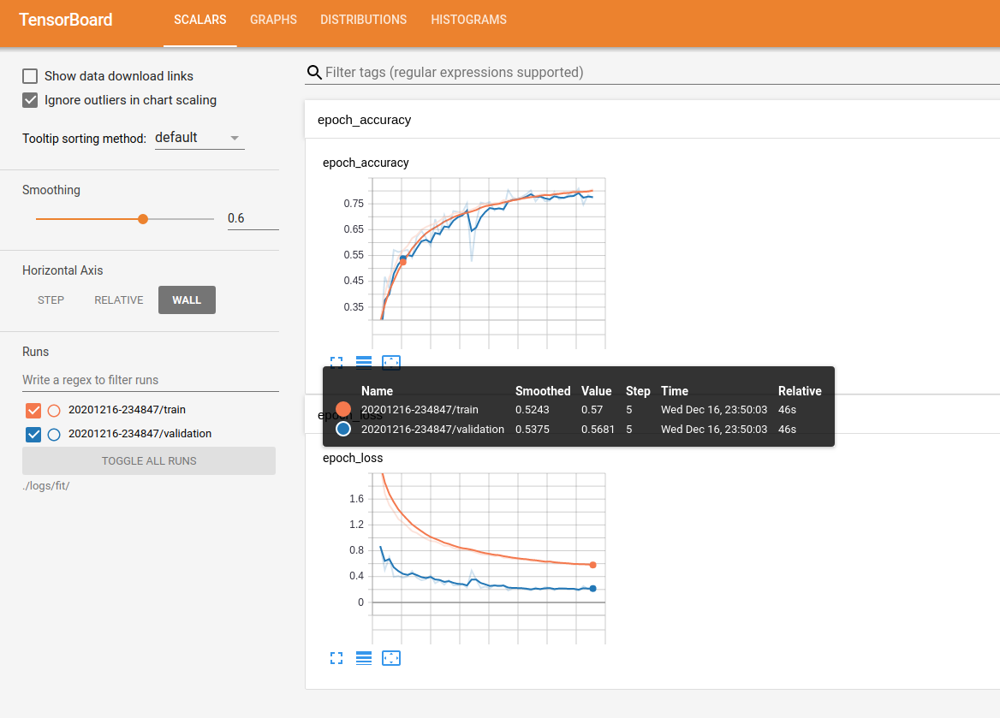

# CIFAR10 with LeNet5, AlexNet, Wide Residual Network in Keras

## Clone this project to your computer:

```
git clone https://github.com/Mayavan/blindspot_monitor.git
```
## Dependencies

* Tensorflow 2.0
* Python 3.6

## To label data
```sh
python3 labelData.py --file ../../video.mp4 --out ../data
```

## To build the neural model

Uncomment the models you want to build in src/createNeuralNetworkModel.py and run the file.
The model will be created and saved in src/saved_models

## To train the neural model

Uncomment the model you want to train in the file src/NeuralNetwork.py.
The results will be plotted and saved in the result folder.



```sh
# Use tensor board to visualize training process
tensorboard --logdir ./logs/fit/
```

## To Convert trained Keras model to a frozen model
```sh
python3 freezeModel.py -m model_name.h5 --frozen model_name.pb
```

## Docker to convert frozen graph to UFF for tensorRT

[Install docker](https://www.digitalocean.com/community/tutorials/how-to-install-and-use-docker-on-ubuntu-16-04)

[Tutorial on how to convert keras model to UFF](https://leimao.github.io/blog/Save-Load-Inference-From-TF2-Frozen-Graph/)

[NVIDIA documentation](https://docs.nvidia.com/deeplearning/tensorrt/container-release-notes/running.html)

#### Install NIVIDIA Container toolkit for CPU support with docker
```sh
# Add the package repositories
distribution=$(. /etc/os-release;echo $ID$VERSION_ID)
curl -s -L https://nvidia.github.io/nvidia-docker/gpgkey | sudo apt-key add -
curl -s -L https://nvidia.github.io/nvidia-docker/$distribution/nvidia-docker.list | sudo tee /etc/apt/sources.list.d/nvidia-docker.list

sudo apt-get update && sudo apt-get install -y nvidia-container-toolkit
sudo systemctl restart docker
```
#### Pull and run TensorRT docker image from NVIDIA
```sh
docker pull nvcr.io/nvidia/tensorrt:20.12-py3
docker run --gpus all -it --rm -v "$PWD:/host" nvcr.io/nvidia/tensorrt:19.12-py3
# To install Python sample dependencies
/opt/tensorrt/python/python_setup.sh

# Convert frozen graph to uff
convert-to-uff /host/frozen_models/model_name.pb -t -O Identity -o /host/frozen_models/model_name.uff
```